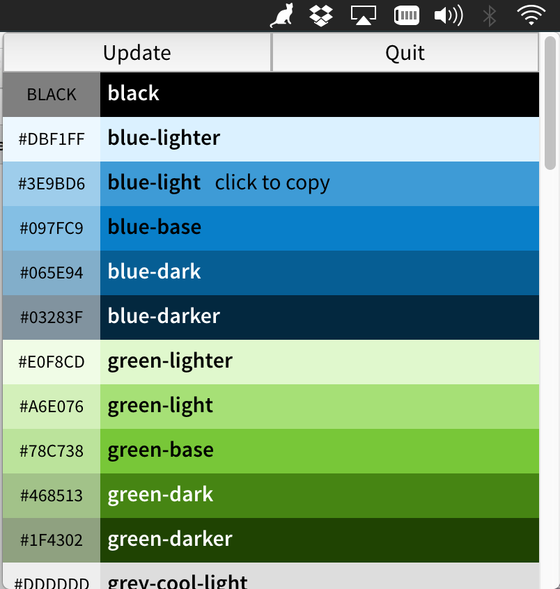

# Radius Menubar
A menubar application for easy access to radius variables.




##Installation
```
git clone git@github.com:guyfedwards/radius-menubar.git
cd radius-menubar && npm install
```


##Run for development
```
npm start
```


##Build electron app
```
npm run build
cp Radius-Menubar-darwin-x64/Radius-Menubar.app /Applications
```
